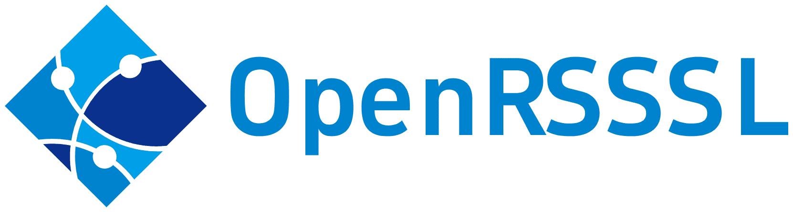

[](https://pytorch.org/get-started/previous-versions/)
[](https://developer.nvidia.com/cuda-downloads)

<p align="center">
    
</p>

<br>

Open Source Remote Sensing Self-supervised Learning.

This repository is OPEN, Pull requests are welcome.

## TODO List

- [x] Create stable VISSL version
- [x] Simplify installation process
- [ ] Complete the Pretrain process
- [ ] Add Remote Sensing Image Segmentation Code
- [ ] Add Remote Sensing Image Classfication Code
- [ ] Add Remote Sensing Image Object Detection Code
- [ ] Create stable OpenRSSSL version
- [ ] Complete the Whole process: From Pretrain to Specific-Task

## Version Record
2024-03-03 openrsssl (alpha version)

## Installation

1. Create Enviroment
```
conda create -n openrsssl_env python=3.8
conda activate openrsssl_env
```
2. Install PyTorch
```
conda install pytorch==2.0.0 torchvision==0.15.0 torchaudio==2.0.0 pytorch-cuda=11.7 -c pytorch -c nvidia
```
Or Visit [Pytorch](https://pytorch.org/) to install

3. Install Apex(optional)
```
pip install packaging
git clone --recursive https://www.github.com/NVIDIA/apex
cd apex
python3 setup.py install
```

4. Install OpenRSSSL

Download OpenRSSSL source code and switch to the source path for installation:

```
git clone --recursive https://github.com/Vaczzy/OpenRSSSL.git
cd OpenRSSSL
pip install --progress-bar off -r requirements.txt
pip install classy-vision@https://github.com/Vaczzy/ClassyVision/tarball/master
pip install -e .[dev]
```

## SSL Pretraining
```
python tools/run_distributed_engines.py config=pretrain/GraSS/grass_1gpu_resnet_b256.yaml \
config.DATA.TRAIN.DATASET_NAMES=["loveda_urban"]
```

## Support Self-supervised Method
### Contrastive Learning Method:
* SimCLR
* MoCo
* BYOL *
* Barlow Twins
* DenseCL *
* SimSiam *
* SwAV
* GLCNet (TGRS) *
* FALSE (GRSL)
* GraSS (TGRS)
* Coming Soon...
### Generative Model Method:
* MAE *
* SimMIM *
* EVA *
* Deconstructing Denoising Diffusion Models for Self-Supervised Learning *
* Coming Soon...
### Self-Distillation Method:
* DINO
* iBOT
* DINO v2
* Coming Soon...

## Acknowledgement
We would like to thank the [VISSL](https://github.com/facebookresearch/vissl) and [MMSegmentation](https://github.com/open-mmlab/mmsegmentation) for its open-source project.